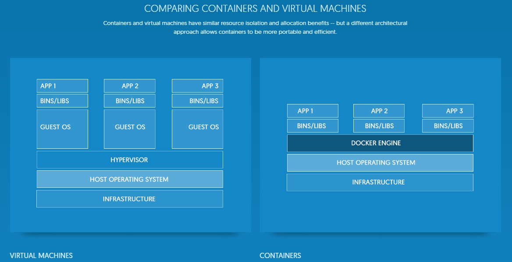

### Docker คืออะไร
**Docker** มันก็คือ Virtualization อย่างนึง โดยมันจะสร้าง Containers เพื่อจำลองสภาพแวดล้อมการทำงานอยู่บนระดับ OS เลย ซึ่งจะต่างกับ VMs ที่ต้องจำลอง Guest OS โดยใช้ Hypervisor (VMware, Virtual Box) ขึ้นมาก่อน  

#HSLIDE

### ข้อดีของ Docker เมื่อเทียบกับ VMs  
